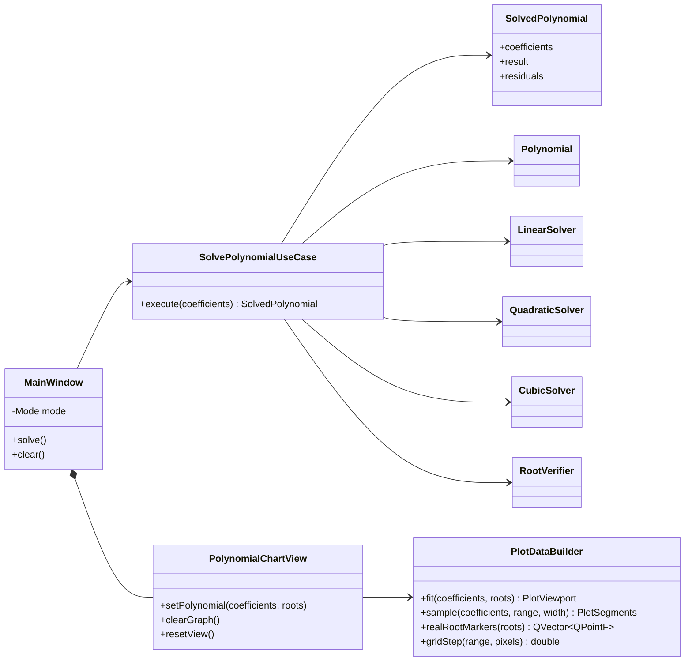
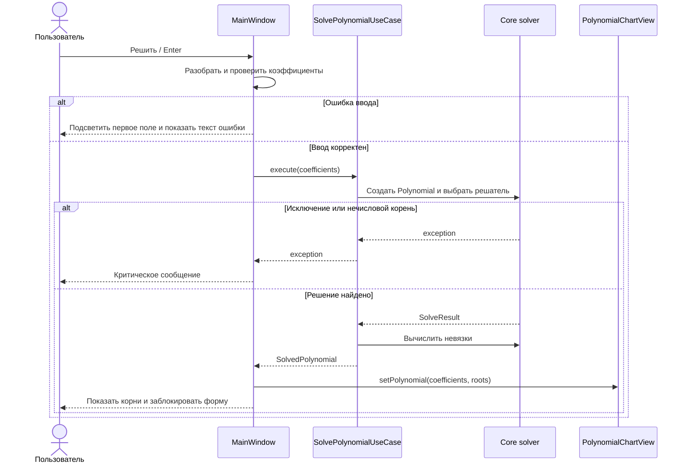
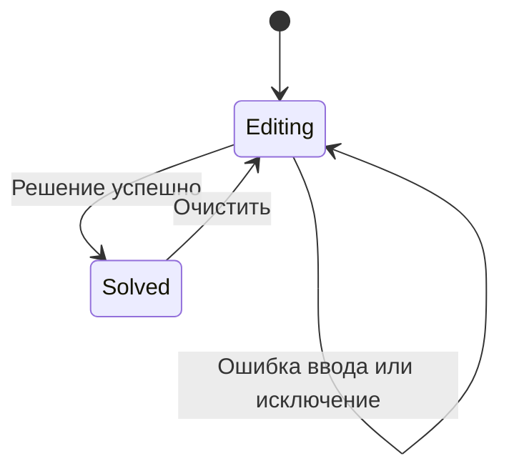

# PolynomialSolver

PolynomialSolver — нативное Windows x64-приложение для решения линейных, квадратных и кубических уравнений. Интерфейс построен на Qt 6 Widgets и Qt Charts, математическое ядро написано на чистом C++20 и не зависит от Qt.

Приложение показывает найденные корни, метод решения, невязку `|P(x)|` для каждого корня и интерактивный график полинома. Числа можно вводить как с точкой, так и с запятой.

## Требования

- Windows x64;
- Qt 6.11 или новее с компонентами Widgets, Charts и Test;
- MinGW 13.1;
- CMake 3.25 или новее;
- Ninja.

Основная конфигурация проекта проверена с:

- `QT_ROOT=C:\Qt\6.11.2\mingw_64`;
- `MINGW_ROOT=C:\Qt\Tools\mingw1310_64`;
- CMake из `C:\Qt\Tools\CMake_64`;
- Ninja из `C:\Qt\Tools\Ninja`.

## Сборка и тестирование

Команды ниже выполняются в PowerShell из корня репозитория:

```powershell
$env:QT_ROOT = 'C:\Qt\6.11.2\mingw_64'
$env:MINGW_ROOT = 'C:\Qt\Tools\mingw1310_64'
$cmake = 'C:\Qt\Tools\CMake_64\bin\cmake.exe'
$ctest = 'C:\Qt\Tools\CMake_64\bin\ctest.exe'

& $cmake --preset debug
& $cmake --build --preset debug
& $ctest --preset debug
```

Release-сборка и создание автономной папки:

```powershell
& $cmake --preset release
& $cmake --build --preset release
& $ctest --preset release
& $cmake --install build/release
```

Готовое приложение запускается из:

```powershell
.\dist\PolynomialSolver\bin\PolynomialSolver.exe
```

Папка `dist\PolynomialSolver` содержит Qt DLL, плагины платформы и MinGW runtime. Установленная копия не требует Qt в `PATH`.

## Управление

1. Выберите степень уравнения от 1 до 3.
2. Введите коэффициенты при `x³ … x⁰`. Введённые значения сохраняются при переключении степени.
3. Нажмите «Решить» или Enter.
4. После решения форма блокируется. Кнопка «Очистить» возвращает её в режим ввода и сбрасывает результат с графиком.

На графике:

- колесо мыши масштабирует область относительно курсора;
- перетаскивание левой кнопкой перемещает видимый диапазон;
- «Сбросить вид» возвращает автоматически рассчитанный диапазон;
- синяя линия показывает полином, красные точки — различные вещественные корни.

## Архитектура

Зависимости направлены от интерфейса к сценарию приложения и далее к математическому ядру. `Core` и `Application` не используют Qt.



Последовательность решения и обработки ошибок:



Состояния главного окна:



## Почему Qt Widgets и Qt Charts

Qt Widgets сохраняет простую модель настольного приложения, нативное управление клавиатурой и предсказуемую компоновку на Windows. Qt Charts предоставляет оси, подписи, сетку и серии данных, а собственный `PlotDataBuilder` оставляет вычисление диапазонов и выборки отдельно тестируемым.

Рисование через `QPainter` уменьшило бы число зависимостей, но потребовало бы самостоятельно реализовать оси, подписи, масштабирование и DPI. QML удобен для анимаций и адаптивных интерфейсов, однако добавил бы второй UI-язык и не дал преимуществ для этой формы.

## Тесты

Qt Test покрывает:

- прежние 27 сценариев математического ядра;
- маршрутизацию решателей, невязки и ошибки application-слоя;
- fit-диапазоны, адаптивную выборку, разрывы кривой и шаг сетки;
- локализованный ввод, переключение степеней и состояния формы;
- zoom, pan, resize, сброс диапазона и очистку графика.

UI-тесты запускаются с `QT_QPA_PLATFORM=offscreen` и не зависят от снимков экрана.

## Лицензирование

Перед внешним распространением приложения необходимо отдельно проверить условия лицензирования используемой поставки Qt и модуля Qt Charts.
