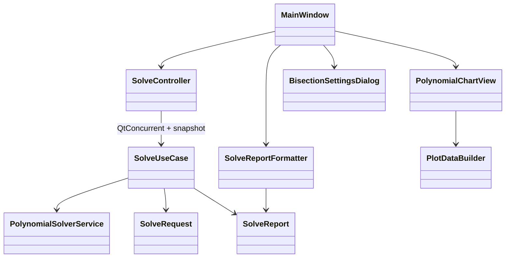
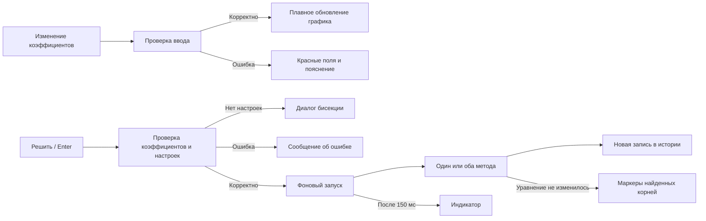

# PolynomialSolver

PolynomialSolver — нативное Windows x64-приложение для решения полиномиальных уравнений степеней от 1 до 5. Интерфейс построен на Qt 6 Widgets и Qt Charts, математическое ядро написано на C++20 и не зависит от Qt.

Коэффициенты можно редактировать непрерывно: график плавно меняется вместе с ними, а результаты явных запусков сохраняются в истории. Приложение показывает корни, метод решения и невязку `|P(x)|` для каждого корня. Поддерживаются точка, запятая и научная запись чисел.

## Требования

- Windows x64;
- Qt 6.11 или новее с компонентами Widgets, Charts, Concurrent и Test;
- MinGW 13.1;
- CMake 3.25 или новее;
- Ninja.

Пути проверенной конфигурации уже записаны в `CMakePresets.json`:

- Qt: `C:\Qt\6.11.2\mingw_64`;
- MinGW: `C:\Qt\Tools\mingw1310_64`;
- CMake: `C:\Qt\Tools\CMake_64`;
- Ninja: `C:\Qt\Tools\Ninja`.

## Сборка и тестирование

Из корня репозитория в PowerShell:

```powershell
$cmake = 'C:\Qt\Tools\CMake_64\bin\cmake.exe'
$ctest = 'C:\Qt\Tools\CMake_64\bin\ctest.exe'

& $cmake --preset debug
& $cmake --build --preset debug
& $ctest --preset debug
```

Release-сборка и создание автономной папки:

```powershell
& $cmake --preset release
& $cmake --build --preset release
& $ctest --preset release
& $cmake --install build/release
```

Готовое приложение:

```powershell
.\dist\PolynomialSolver\bin\PolynomialSolver.exe
```

В папке `dist\PolynomialSolver` находятся Qt DLL, плагины и MinGW runtime. Установленной копии Qt в `PATH` не требуется.

## Работа в Qt Creator

Откройте корневой `CMakeLists.txt`, выберите preset `PolynomialSolver: Qt Debug` или `PolynomialSolver: Qt Release`, настройте проект. Компилятор, Qt, CMake, Ninja и GDB берутся из `CMakePresets.json`. Сборка — Ctrl+B, запуск — Ctrl+R, отладка — F5.

После изменения presets выберите «Сборка → Перезагрузить CMake Presets». Локальные настройки Qt Creator хранятся в игнорируемом каталоге `.qtcreator`.

`src/PolynomialSolver.UI/MainWindow.ui` открывается в визуальном дизайнере. Поля коэффициентов создаются программно в зависимости от степени. Диалог бисекции реализован отдельно в `BisectionSettingsDialog`.

## Управление

1. Выберите степень 1–5 и введите коэффициенты. Значения сохраняются при переключении степени.
2. График отображается сразу и плавно обновляется при корректном изменении коэффициентов. Масштаб и центр сохраняются; запускать решение для просмотра кривой не нужно.
3. Выберите «Аналитический», «Бисекция» или «Оба метода». Аналитическое решение и сравнение доступны для степеней 1–3; для 4–5 автоматически выбирается бисекция.
4. Для численного метода нажмите кнопку с шестерёнкой («Настройки бисекции»), заполните интервал и нажмите «Применить».
5. Нажмите «Решить» или Enter в поле коэффициента. Если численные настройки ещё не заданы, сначала откроется их диалог; после применения нажмите «Решить» снова.
6. Продолжайте редактировать уравнение и запускать расчёты. Форма после решения остаётся доступной.

Неактивная кнопка настроек скрыта: шестерёнка появляется только для бисекции и сравнения. Вычисление выполняется в рабочем потоке. На это время блокируется повторное нажатие «Решить», а коэффициенты можно менять. Если ответ не готов за 150 мс, рядом с кнопкой появляется небольшой индикатор; быстрые расчёты проходят без его мигания. Завершившийся расчёт сохраняет исходное уравнение и параметры. Если коэффициенты уже изменены, его корни не подменяют текущий график.

Ошибочные поля подчёркиваются красным сразу, пояснение появляется под полями ввода. Пустые коэффициенты, нечисловые и бесконечные значения недопустимы; старший коэффициент не может быть нулём. Пока коэффициенты некорректны, кривая скрыта. Исправление автоматически возвращает график и убирает подсветку, не перехватывая фокус. При нажатии «Решить» с ошибочным вводом дополнительно появляется сообщение об ошибке.

## Настройки бисекции

Настройки открываются отдельным модальным диалогом. Обе границы изначально пустые и обязательны; левая должна быть меньше правой. Точность задаётся количеством знаков после запятой (0–15, по умолчанию 6).

**Флажок «Найти все корни» выключен:** шаг скрыт, предварительный поиск не выполняется. Метод бисекции применяется непосредственно ко всему указанному интервалу и возвращает один корень. На концах должны быть разные знаки `P(x)` или один из концов должен быть корнем. Одинаковые ненулевые знаки вызывают объясняющую ошибку; это не доказывает отсутствия корней внутри интервала.

**Флажок включён:** появляется поле «Шаг поиска» (по умолчанию 0.25). Сначала интервал сканируется с этим шагом. Участки со сменой знака уточняются бисекцией, корни на узлах и границах также учитываются. Последний участок при необходимости сокращается до правой границы.

Сканирование не гарантирует полноту: кратный корень между узлами или несколько корней внутри одного шага могут быть пропущены. Уменьшение шага повышает детализацию поиска, а точность отвечает за уточнение найденных корней. Допускается не более 100 000 участков. Слишком мелкий шаг, не позволяющий продвинуться к следующей точке, отклоняется. Если запрошенная точность недостижима, решение сообщает об этом.

Пустые границы отмечаются сразу. «Применить» доступно только при корректных настройках; оно сохраняет их и закрывает диалог. «Отмена» или закрытие окна отбрасывают черновик. В режиме одного корня скрытый шаг не участвует в проверке. Применённые настройки сохраняются до завершения приложения. Красное подчёркивание сохраняет нативную рамку и размер поля.

«Отмена» расположена слева от «Применить».

## История и сравнение

Каждое решение добавляет в моноширинный журнал номер расчёта, уравнение, метод, численные параметры, корни и невязки. Последняя запись выделена полужирным шрифтом без цветного фона. Текст можно выделить и скопировать.

В режиме «Оба метода» результаты находятся в одной записи с отдельными заголовками. Аналитический метод показывает все корни, включая комплексные и повторения; бисекция — вещественные корни указанного интервала в выбранном режиме. Если один метод завершился ошибкой, результат другого сохраняется, а ошибка подписана своим методом и дополнительно показана сообщением.

«Очистить историю» находится в разделе истории и удаляет записи, сохраняя уравнение, график и настройки. Следующий расчёт снова получает номер 1. История хранится в памяти текущего сеанса.

## График

- Синяя линия — полином, красные точки — различные найденные вещественные корни.
- Масштаб всегда 1:1: единица по X и единица по Y занимают одинаковую длину на экране. Сетка также имеет одинаковый шаг по обеим осям.
- Поля под подписи осей зарезервированы заранее: смена подписей при приближении не сдвигает область построения.
- Новое уравнение плавно изменяет линию за 200 мс, переиспользуя существующие серии. Оси при вводе и после решения не подгоняются под значения функции. Повторный ввод перенаправляет текущую анимацию к последним данным.
- Кривая использует две точки на физический пиксель по горизонтали. При анимации и перемещении работает штатная отрисовка Qt; в покое применяется дополнительное сглаживание. Штатный цикл перерисовки сохраняется во всех случаях.
- При смене диапазона шаг оси согласуется с ним до увеличения масштаба, чтобы не создавать миллионы промежуточных делений.
- При изменении коэффициентов старые маркеры корней убираются до следующего решения.
- Колесо мыши одинаково масштабирует обе оси относительно курсора; перетаскивание левой кнопкой перемещает область.
- «Сбросить вид» возвращает центр (0, 0) и начальный общий масштаб. Размер окна определяет видимый диапазон; изменение размера сохраняет единичный масштаб и центр.
- Изменение коэффициентов, решение и временная ошибка ввода сохраняют выбранный вид. Корни за пределами окна видны после ручного перемещения или уменьшения масштаба. Полином не ограничен конечным экраном: глубокий экстремум при честном 1:1 может потребовать отдельного приближения и перемещения.
- Масштабирование и перемещение останавливают текущую анимацию и передают управление пользователю.
- При достижении предела числовой точности дальнейшее приближение отклоняется. Если изменение размера окна выходит за представимый диапазон, общий масштаб корректируется с сохранением 1:1. Перед отрисовкой кривая обрезается по видимой области с сохранением пересечений границ.

Разделитель между историей и графиком можно перемещать мышью.

## Архитектура

`PolynomialSolver.Core` не зависит от Qt. `PolynomialSolverService` служит фасадом над решателями и общей проверкой конечности корней и невязок. `BisectionSolver::solveOne` уточняет один корень без сканирования; `BisectionSolver::solve` сканирует интервал и уточняет найденные участки.

`SolveUseCase` выполняет сценарий одного метода или сравнения. Две внутренние стратегии выбирают аналитический и численный алгоритмы; ошибка одного не уничтожает результат другого. `SolveRequest` объединяет полином, типизированный режим и `BisectionOptions`; `SolveReport` содержит снимок запроса и отдельные результаты методов.

`SolveController` запускает сценарий через Qt Concurrent, управляет состоянием занятости и задержкой индикатора. Рабочая задача получает копии данных и вычислительной операции, не захватывая окно. Уничтожение контроллера отключает доставку ответа без ожидания рабочего потока. `SolveReportFormatter` готовит текст отчёта отдельно от виджетов.

`BisectionSettingsDialog` разделяет черновик и применённые настройки. `MainWindow` остаётся представлением: проверяет поля, обновляет предпросмотр, передаёт запрос контроллеру и отображает отчёт. `PolynomialChartView` хранит центр и один общий масштаб; `PlotDataBuilder` строит согласованный viewport по фактическому размеру области рисования и готовит выборку кривой.

Рефакторинг ориентирован на [лекцию П. Радилова об архитектуре и рефакторинге](https://radilov-spsu.github.io/materials/OOP/lectures/02-arkhitektura-i-refaktoring/):

| Проблема в проекте | Изменение |
| --- | --- |
| Long Method / Large Class: окно запускало методы, собирало ошибки и форматировало отчёт | Сценарий, фоновое выполнение и форматирование выделены в самостоятельные компоненты |
| Duplicate Code: разные пути отдельно проверяли корни и невязки | Общая проверка результата в математическом сервисе |
| Primitive Obsession: режимы решения обозначались индексами списка | `SolveMode` и данные элементов интерфейса |
| Data Clumps / Long Parameter List: параметры бисекции передавались разрозненно | `BisectionOptions` внутри запроса; старые API сервиса сохранены |
| Скрытая зависимость ответа от текущего содержимого формы | Снимок запроса и проверка актуальности графика |

Фасад, стратегии и контроллер с уведомлениями имеют реальные обязанности. Дополнительные фабрики, глобальные одиночки и публичные иерархии ради количества паттернов не вводятся.


```mermaid
classDiagram
    MainWindow --> SolveController
    MainWindow --> SolveReportFormatter
    MainWindow --> PolynomialChartView
    MainWindow --> BisectionSettingsDialog
    SolveController --> SolveUseCase : QtConcurrent + snapshot
    SolveUseCase --> PolynomialSolverService
    SolveUseCase --> SolveRequest
    SolveUseCase --> SolveReport
    SolveReportFormatter --> SolveReport
    PolynomialChartView --> PlotDataBuilder
```


```mermaid
flowchart LR
    Input[Изменение коэффициентов] --> Validation[Проверка ввода]
    Validation -->|Корректно| Chart[Плавное обновление графика]
    Validation -->|Ошибка| Inline[Красные поля и пояснение]
    Solve[Решить / Enter] --> Check[Проверка коэффициентов и настроек]
    Check -->|Нет настроек| Dialog[Диалог бисекции]
    Check -->|Ошибка| Message[Сообщение об ошибке]
    Check -->|Корректно| Worker[Фоновый запуск]
    Worker --> Methods[Один или оба метода]
    Worker -->|После 150 мс| Busy[Индикатор]
    Methods --> History[Новая запись в истории]
    Methods -->|Уравнение не изменилось| Markers[Маркеры найденных корней]
```

## Тесты

14 наборов Qt Test покрывают математическое ядро, сценарии решения и сравнения, форматирование отчётов, численные режимы и ограничения сканирования, проверку невязок, парсер, настройки, живой график, историю и фоновый контроллер.

Регрессии включают автоматическую перерисовку после последовательных корректных изменений без принудительного `grab()`, согласованность шага и диапазона осей при расширении и сужении, полином `x⁵ + 54x⁴ + 23x³ + 3x² + 4x + 5`, задержку индикатора, отзывчивость цикла событий, запрет дублирующего запуска, исключения рабочего потока, закрытие во время расчёта и устаревший ответ после редактирования. Проверяются отсутствие цветного фона истории, её нумерация, неизменные размеры ошибочных полей и порядок кнопок диалога.

UI-тесты запускаются с `QT_QPA_PLATFORM=offscreen` и не зависят от снимков экрана.

Измерение покрытия GCC/gcov выполняется в отдельной сборке `build/coverage-diagnostic`; итоговый отчёт — `build/coverage-diagnostic/coverage-summary.md`. Считаются уникальные исполняемые строки исходников проекта, без Qt, тестов и автоматически созданного кода. Покрытие дополняет проверки поведения, а не заменяет их.

## Лицензирование

Перед внешним распространением приложения необходимо отдельно проверить условия лицензирования используемой поставки Qt и модуля Qt Charts.
